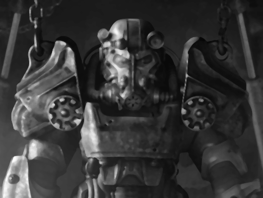
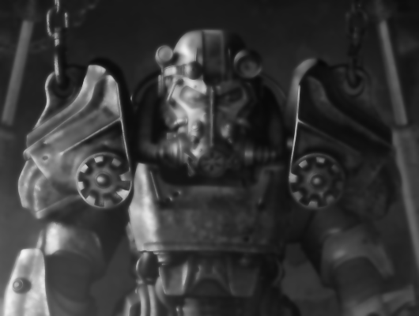
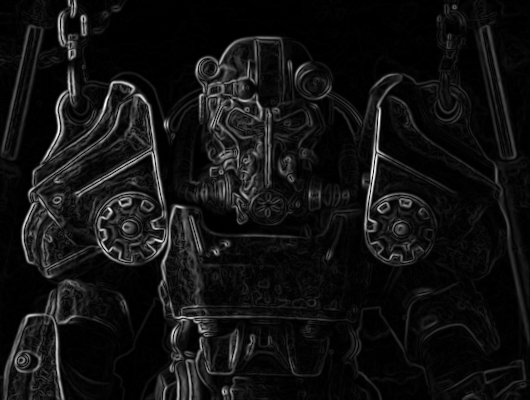
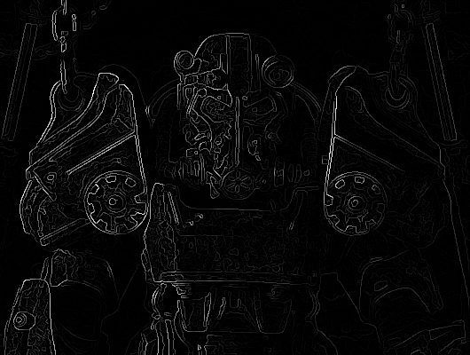
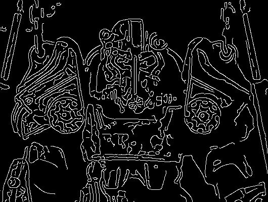

# Image Processing Modern Methods
MPh CMC MSU Course
____
## Фильтрации 

### Фильтр Гаусса
| | |
|:----:|:----:|
|   |    |
### Медианная фильтрация
| | |
|:----:|:----:|
|   |    |

### Билатеральная фильтрация
| | |
|:----:|:----:|
|   |    |

## Детектирование контуров

### Модуль градиента
| | |
|:----:|:----:|
|   |     |

### Подавление немаксимумов модуля градиента
| | |
|:----:|:----:|
|   |    |

### Алгоритм Канни
| | |
|:----:|:----:|
|   |    |
